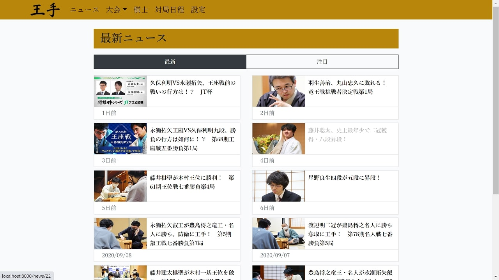

# 王手.com

将棋のニュースサイト（ポートフォリオ用）

## 概要

将棋のニュースを手軽にチェックしてもっと将棋を楽しもう！

## 機能

-ニュース一覧からニュースをクリックするとニュースの記事、コメントが見れる。 
-ニュースに関連する棋士、大会が表にまとめられそれをクリックするとその棋士、大会詳細ページに飛べる。 
-棋士一覧から棋士をクリックするとその棋士の詳細ページに飛べる。 
-棋士詳細ページではその棋士に関連するニュース一覧が見れる。
-大会も棋士と同様。 

### アカウントを作成すると...

-各ニュースでコメントができるようになる。 
-コメントにいいねが付けられるようになる。 
-棋士、大会をお気に入り登録できるようになる。 
-履歴を確認できるようになる。 

## 使用フレームワーク

Laravel、Vue.js、bootstrap

## 開発予定

-コメント返信機能 
-ユーザーのプロフィール画像機能 
-対局日程機能 
-コードの部品化 
-admin用ページの追加 

## 環境構築

1. .envファイル作成 
2. composer install 
3. npm install 
4. php artisan storage:link 
5. データベース作成 
6. php artisan migrate 
7. php artisan db:seed 
8. npm run dev
9. php artisan serve